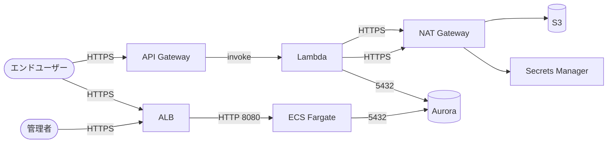

# VPC・ネットワーク設計

> **対象システム:** order-processing-system（ECサイト注文処理）  
> **リージョン:** ap-northeast-1（東京）  
> **更新日:** 2026-04-15

---

## VPC 構成（空間レイアウト）

```
┌─────────────────────────────────────────────────────────┐
│  VPC  10.0.0.0/16   (ap-northeast-1)                    │
│                                                          │
│  ┌─────────────────────────────────────────────────┐    │
│  │  パブリックサブネット                            │    │
│  │  10.0.0.0/24 (1a)  /  10.0.1.0/24 (1c)         │    │
│  │  ALB,  NAT Gateway                              │    │
│  └─────────────────────────────────────────────────┘    │
│  ┌─────────────────────────────────────────────────┐    │
│  │  プライベート・アプリ層                          │    │
│  │  10.0.10.0/24 (1a)  /  10.0.11.0/24 (1c)        │    │
│  │  Lambda,  ECS Fargate                           │    │
│  └─────────────────────────────────────────────────┘    │
│  ┌─────────────────────────────────────────────────┐    │
│  │  プライベート・DB 層                             │    │
│  │  10.0.20.0/24 (1a)  /  10.0.21.0/24 (1c)        │    │
│  │  Aurora PostgreSQL（インターネット経路なし）     │    │
│  └─────────────────────────────────────────────────┘    │
└─────────────────────────────────────────────────────────┘

VPC 外 AWS サービス: API Gateway / S3 / SQS / Secrets Manager
```

## 通信フロー



---

## サブネット一覧

| 名前 | CIDR | AZ | 用途 | インターネット経路 |
|---|---|---|---|---|
| public-1a | 10.0.0.0/24 | 1a | ALB、NAT Gateway | IGW 直接 |
| public-1c | 10.0.1.0/24 | 1c | ALB | IGW 直接 |
| app-1a | 10.0.10.0/24 | 1a | Lambda、ECS | NAT Gateway 経由 |
| app-1c | 10.0.11.0/24 | 1c | Lambda、ECS | NAT Gateway 経由 |
| db-1a | 10.0.20.0/24 | 1a | Aurora プライマリ | **なし（完全プライベート）** |
| db-1c | 10.0.21.0/24 | 1c | Aurora レプリカ | **なし（完全プライベート）** |

> **設計判断:** NAT Gateway は 1a のみ（コスト最適化）。  
> 障害時に 1c の Lambda も 1a の NAT を経由するため、1a 障害時に外部通信が止まる。  
> 許容できない場合は 1c にも NAT Gateway を追加する（月 +$32 程度）。

---

## セキュリティグループ設計

### 命名規則
`<システム略称>-<役割>-sg` 例: `order-alb-sg`

### 一覧

| SG 名 | アタッチ先 | インバウンド | アウトバウンド |
|---|---|---|---|
| order-alb-sg | ALB | 443/tcp 0.0.0.0/0 | 8080/tcp → order-app-sg |
| order-app-sg | ECS, Lambda | 8080/tcp ← order-alb-sg のみ | 5432/tcp → order-db-sg, 443/tcp → 0.0.0.0/0 |
| order-db-sg | Aurora | 5432/tcp ← order-app-sg のみ | **なし** |

> **重要:** DB のアウトバウンドはすべて拒否。DB から外部への通信は設計上あってはならない。

### セキュリティグループ間参照の原則

```
[order-alb-sg] → [order-app-sg] → [order-db-sg]
```

CIDR 指定（`10.0.0.0/16` など）ではなく、**SG 参照を使う**。  
理由: サブネット追加時に SG ルールを変更不要になるため。

---

## VPC エンドポイント

プライベートサブネットから AWS サービスへのアクセスは、インターネット経由を避けるために VPC エンドポイントを使う。

| サービス | エンドポイント種別 | 理由 |
|---|---|---|
| S3 | ゲートウェイ型（無料） | 大量のオブジェクト PUT/GET がある |
| Secrets Manager | インターフェース型 | セキュリティ上、インターネット経由は不可 |
| SQS | インターフェース型 | Lambda が頻繁にアクセスする |
| ECR | インターフェース型（ecr.api + ecr.dkr + s3） | Fargate のイメージ pull |

> **注意:** Secrets Manager・SQS はインターフェース型（= ENI が作られ時間課金）。  
> 合計で月 $15〜30 程度。NAT Gateway 経由の通信量コストと比較して判断する。

---

## Terraform 定義（抜粋）

```hcl
# vpc.tf — AI はこのスタイルで追加リソースを書くこと

module "vpc" {
  source  = "terraform-aws-modules/vpc/aws"
  version = "~> 5.8"

  name = "order-vpc"
  cidr = "10.0.0.0/16"

  azs              = ["ap-northeast-1a", "ap-northeast-1c"]
  public_subnets   = ["10.0.0.0/24", "10.0.1.0/24"]
  private_subnets  = ["10.0.10.0/24", "10.0.11.0/24"]
  database_subnets = ["10.0.20.0/24", "10.0.21.0/24"]

  enable_nat_gateway     = true
  single_nat_gateway     = true   # コスト最適化: 1a のみ
  enable_dns_hostnames   = true
  enable_dns_support     = true

  tags = local.common_tags
}
```

---

## 設計上の禁止事項（AI 参照用）

- DB サブネットへのパブリック IP 割り当て禁止
- SG に `0.0.0.0/0` を許可するのは ALB の 443 のみ
- Bastion Host は作らない（SSM Session Manager を使う）
- NAT Gateway を db サブネットのルートテーブルに追加しない
