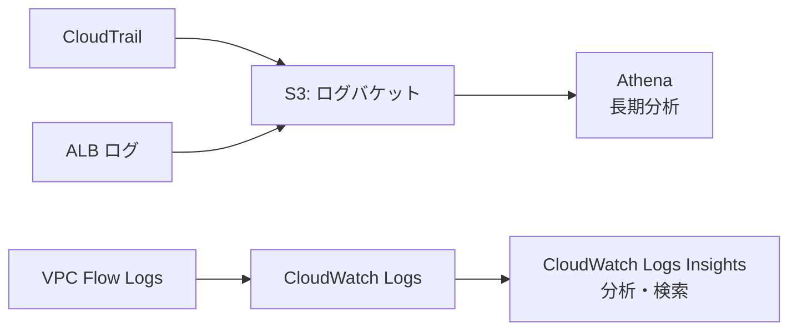

# セキュリティ設計

> **方針:** AWS Well-Architected Framework セキュリティの柱に準拠  
> **コンプライアンス要件:** PCI-DSS Level 3（カード情報はこのシステムに保存しない）

---

## 多層防御の考え方

```
[インターネット]
     ↓ WAF（レート制限・SQLi/XSS ブロック）
[ALB / API Gateway]
     ↓ TLS 1.2+ 強制
[アプリケーション層]
     ↓ VPC SG でポート制限
[DB 層]
     ↓ 暗号化（保存・通信）
[データ]
```

各層で独立したセキュリティコントロールを持つ。1層が突破されても次の層で防ぐ。

---

## 暗号化方針

| データの種類 | 保存時 | 転送時 | 備考 |
|---|---|---|---|
| DB データ | AES-256（Aurora 標準） | TLS（RDS forced SSL） | `rds.force_ssl=1` を必ず設定 |
| S3 オブジェクト | SSE-S3 | TLS（S3 バケットポリシーで強制） | SSE-KMS はコスト増のため不要 |
| SQS メッセージ | SSE-SQS | TLS | |
| シークレット | KMS（Secrets Manager 管理） | TLS | ローテーション 30 日ごと |

> **KMS の使い分け:** SSE-KMS は API 呼び出しごとにコストが発生する（$0.03/10,000 req）。  
> S3 は SSE-S3 で十分。監査要件があるキーのみ KMS を使う。

---

## シークレット管理

**原則: 環境変数・コード・設定ファイルにシークレットを書かない。**

```
取得フロー:
Lambda 起動 → Secrets Manager GetSecretValue → メモリ内に保持 → 処理終了で破棄
```

| シークレット名 | 中身 | ローテーション |
|---|---|---|
| `order/stripe` | Stripe シークレットキー | 手動（Stripe ダッシュボードで更新後に手動ローテーション） |
| `order/shipping` | 配送 API キー | 手動 |
| `order/db/master` | DB マスターパスワード | Secrets Manager 自動ローテーション（30 日） |

> **Lambda でのキャッシュ:** コールドスタートのたびに Secrets Manager を呼ぶとレイテンシが増える。  
> グローバル変数に保持し、TTL（5 分）を設けてキャッシュする実装を推奨。

---

## AWS WAF 設定

API Gateway の前段に WAF を設置する。

| ルール | アクション | 理由 |
|---|---|---|
| AWSManagedRulesCommonRuleSet | ブロック | OWASP Top 10 対策 |
| AWSManagedRulesSQLiRuleSet | ブロック | SQL インジェクション対策 |
| レート制限: IP ごと 500 req/5min | ブロック | ブルートフォース・DoS 対策 |
| GeoMatch: 日本以外 | COUNT（監視のみ） | ブロックはしない（海外からの正規アクセスがある可能性）|

> **注意:** WAF は月 $5/WebACL + ルール数 × $1 + リクエスト数課金。  
> 月間 1 億 req 以下なら約 $20〜30。

---

## 証跡・ログ設計

セキュリティインシデント時に「誰が・いつ・何をしたか」を追えるようにする。

| ログ種別 | 取得場所 | 保持期間 | 理由 |
|---|---|---|---|
| CloudTrail | S3（全リージョン） | 1 年 | API 操作の全記録。PCI-DSS 要件 |
| VPC Flow Logs | CloudWatch Logs | 90 日 | 不審な通信の調査用 |
| ALB アクセスログ | S3 | 90 日 | リクエスト内容の確認 |
| Lambda ログ | CloudWatch Logs | 30 日 | アプリケーションログ |
| RDS 監査ログ | CloudWatch Logs | 30 日 | DB へのクエリ記録 |



---

## 設計上の禁止事項（AI 参照用）

- S3 バケットのパブリックアクセスは全て無効（Block Public Access 4 項目すべて ON）
- IAM ユーザーへの長期アクセスキー発行禁止（IAM ロールを使う）
- Security Group で `0.0.0.0/0` を許可するのは ALB の 443 のみ
- `aws:SecureTransport: false` の S3 アクセスを拒否するバケットポリシーを必ず設定
- CloudTrail は無効化しない・ログバケットのバージョニングは必ず有効
