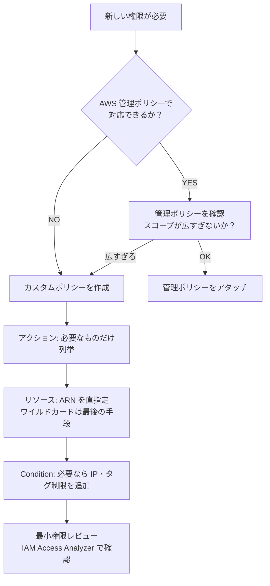

# IAM 設計

> **原則:** 最小権限（Least Privilege）。必要なアクション・リソースのみを許可する。

---

## ロール一覧

| ロール名 | アタッチ先 | 目的 |
|---|---|---|
| order-lambda-create-role | Lambda: order-create | 注文作成 Lambda の実行権限 |
| order-lambda-process-role | Lambda: order-process | 注文処理 Lambda の実行権限 |
| order-ecs-task-role | ECS タスク | 管理 API コンテナの実行権限 |
| order-ecs-execution-role | ECS タスク実行 | ECR pull・ログ送信（ECS が使う） |
| order-deploy-role | CI/CD（GitHub Actions） | デプロイ用。AssumeRole で一時的に使う |

> **`order-ecs-task-role` と `order-ecs-execution-role` の違い**  
> - `execution-role`: ECS がコンテナを**起動するために**使うロール（ECR pull, CW Logs push）  
> - `task-role`: コンテナ内のアプリが**AWS API を呼ぶために**使うロール  
> 研修でよく混同される。2つは別物。

---

## ロール詳細

### order-lambda-create-role

```
許可するアクション:
  SQS:
    - sqs:SendMessage
    リソース: arn:aws:sqs:ap-northeast-1:*:order-queue

  Secrets Manager:
    - secretsmanager:GetSecretValue
    リソース: arn:aws:secretsmanager:ap-northeast-1:*:secret:order/*

  SSM:
    - ssm:GetParameter
    リソース: arn:aws:ssm:ap-northeast-1:*:parameter/order/*

  DynamoDB（冪等性テーブル）:
    - dynamodb:GetItem
    - dynamodb:PutItem
    リソース: arn:aws:dynamodb:ap-northeast-1:*:table/order-idempotency

  CloudWatch Logs（Lambda 基本実行）:
    - logs:CreateLogGroup
    - logs:CreateLogStream
    - logs:PutLogEvents
    リソース: arn:aws:logs:ap-northeast-1:*:log-group:/aws/lambda/order-create:*

  X-Ray:
    - xray:PutTraceSegments
    - xray:PutTelemetryRecords
    リソース: "*"
```

> **設計判断:** `sqs:SendMessage` のリソースはキュー ARN を直指定（`*` は使わない）。  
> 誤送信を防ぐために対象キューを明示する。

### order-lambda-process-role

```
許可するアクション（order-create-role との差分）:
  SQS（追加）:
    - sqs:ReceiveMessage
    - sqs:DeleteMessage
    - sqs:ChangeMessageVisibility
    リソース: arn:aws:sqs:ap-northeast-1:*:order-queue

  S3:
    - s3:PutObject
    リソース: arn:aws:s3:::order-receipts-*/receipts/*
    ※ バケット全体へのアクセスは与えない（プレフィックス制限）
```

### order-deploy-role（CI/CD 用）

GitHub Actions OIDC を使って一時クレデンシャルを取得する。  
**長期アクセスキーを GitHub Secrets に保存しない。**

```
信頼ポリシー:
  Principal: { Federated: "arn:aws:iam::*:oidc-provider/token.actions.githubusercontent.com" }
  Condition:
    StringEquals:
      token.actions.githubusercontent.com:aud: sts.amazonaws.com
      token.actions.githubusercontent.com:sub: repo:<org>/<repo>:ref:refs/heads/main
    ← main ブランチからのデプロイのみ許可

許可するアクション:
  Lambda: UpdateFunctionCode, UpdateFunctionConfiguration
  ECR: GetAuthorizationToken, BatchCheckLayerAvailability, PutImage ...
  S3（Terraform state）: GetObject, PutObject, DeleteObject
  DynamoDB（Terraform lock）: GetItem, PutItem, DeleteItem
```

---

## IAM ポリシー設計の判断フロー



---

## よくある間違い（研修用）

| 間違い | 正しい設計 |
|---|---|
| `"Resource": "*"` を全アクションに使う | リソース ARN を直指定する |
| AdministratorAccess を Lambda に付与 | 必要なアクションのみのカスタムポリシー |
| CI/CD にアクセスキーを発行 | OIDC で一時クレデンシャルを取得 |
| task-role と execution-role を同じにする | 役割が違うので分ける |
| `iam:*` を含むポリシーを許可 | IAM 操作は別の管理ロールに分離 |

---

## 設計上の禁止事項（AI 参照用）

- `"Resource": "*"` は X-Ray・CloudWatch Logs 以外で使用禁止
- AdministratorAccess ポリシーはどのロールにもアタッチしない
- IAM ユーザーへのアクセスキー発行禁止（人間のアクセスは SSO / ロールスイッチ）
- `iam:PassRole` を広く許可しない（特定ロールの ARN に制限する）
