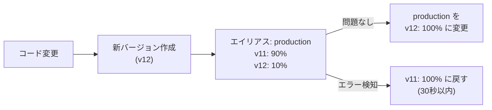
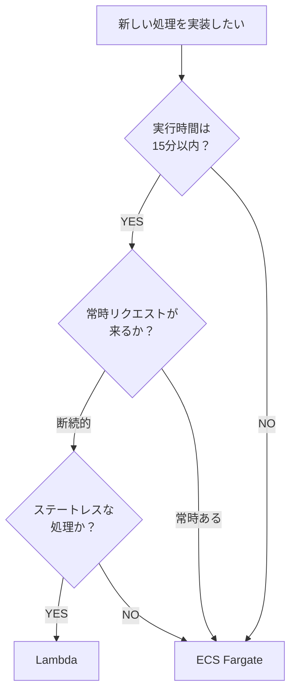

# コンピューティング設計

> **対象システム:** order-processing-system  
> **使用サービス:** AWS Lambda、Amazon ECS Fargate

---

## コンピューティング構成の全体像

このシステムでは用途に応じて Lambda と ECS Fargate を使い分ける。

| 用途 | サービス | 理由 |
|---|---|---|
| 注文作成・処理（イベント駆動） | Lambda | リクエスト単位の起動・従量課金・スケールが容易 |
| 管理 API（常時稼働・長時間処理） | ECS Fargate | コンテナ常駐・30秒超の処理・WebSocket 対応 |

---

## Lambda 設計

### 関数一覧

| 関数名 | トリガー | 役割 | タイムアウト | メモリ |
|---|---|---|---|---|
| order-create | API Gateway (POST /orders) | 注文作成・在庫確認・SQS エンキュー | 10 秒 | 512 MB |
| order-process | SQS (order-queue) | 決済・配送手配・DB 更新 | 30 秒 | 512 MB |
| receipt-generate | S3 イベント (orders/ PUT) | 領収書 PDF 生成・S3 保存 | 60 秒 | 1024 MB |

### 共通設定

| 項目 | 値 | 理由 |
|---|---|---|
| ランタイム | python3.12 | 最新 LTS。3.11 以前は使わない |
| アーキテクチャ | arm64 (Graviton2) | x86_64 比で約 20% コスト削減 |
| 同時実行数の上限 | 100（関数ごと） | アカウント全体の上限を使い切らないよう制限 |
| デッドレターキュー | 各関数に設定 | 非同期失敗時の取りこぼし防止 |
| X-Ray トレーシング | Active | 分散トレーシング必須 |

### コールドスタート対策

```
Lambda のコールドスタート発生タイミング:
  - 初回起動時
  - スケールアウト時（並列実行数が増えたとき）
  - 約15分間リクエストがなかった後

対策:
  order-create のみ Provisioned Concurrency = 2 を設定
  （ユーザー向け同期 API のため p99 レイテンシを安定させる）

  order-process / receipt-generate は非同期のため対策不要
```

> **Provisioned Concurrency のコスト:** $0.015/GB-hour × 0.5GB × 2 = 約 $11/月  
> レイテンシ要件が緩和されたら外してよい。

### デプロイ構成（バージョン管理）



### Lambda ディレクトリ構成（AI 参照用）

```
src/functions/
├── order_create/
│   ├── handler.py        # lambda_handler はここ
│   ├── service.py        # ビジネスロジック
│   └── repository.py     # DB アクセス
├── order_process/
│   ├── handler.py
│   ├── service.py
│   └── repository.py
└── shared/               # 関数間共有コード（Lambda Layer）
    ├── db.py             # DB 接続管理
    ├── secrets.py        # Secrets Manager キャッシュ
    └── logger.py         # structlog 設定
```

> **Lambda Layer の使いどころ:** `shared/` のように複数関数で使うコードと  
> 依存ライブラリ（psycopg2 など）を Layer にまとめる。  
> ただし Layer の乱用はデプロイ管理が煩雑になるため、共有コードのみに限定する。

---

## ECS Fargate 設計

### タスク定義

| 項目 | 値 |
|---|---|
| クラスター名 | order-cluster |
| サービス名 | order-admin-api |
| タスク CPU | 256 (.25 vCPU) |
| タスク メモリ | 512 MB |
| 実行数（desired） | 2（最低限の冗長性） |
| OS | Linux/ARM64（Graviton） |

### オートスケーリング

| メトリクス | スケールアウト閾値 | スケールイン閾値 | 最小/最大タスク数 |
|---|---|---|---|
| CPU 使用率 | 70% | 30% | 2 / 10 |
| ALB リクエスト数/タスク | 500 req/min | 100 req/min | 2 / 10 |

> **最小タスク数を 2 にする理由:** 1 タスクだとデプロイ中（ローリングアップデート時）に  
> 一瞬ゼロになる可能性がある。2 タスクあれば 1 台ずつ入れ替えられる。

### コンテナ設定

```
コンテナ名: admin-api
イメージ:   <account>.dkr.ecr.ap-northeast-1.amazonaws.com/order-admin-api:latest
ポート:     8080 (TCP)
ヘルスチェック:
  コマンド: curl -f http://localhost:8080/health || exit 1
  interval: 30s
  timeout:  5s
  retries:  3

環境変数（シークレットは Secrets Manager 参照）:
  DATABASE_URL:      secretsmanager:order/db/url
  STRIPE_SECRET_KEY: secretsmanager:order/stripe
  LOG_LEVEL:         INFO
  PORT:              8080
```

### Dockerfile 設計方針（AI 参照用）

```dockerfile
# マルチステージビルドを使うこと（本番イメージを小さくする）
# ベースイメージは python:3.12-slim-bookworm（alpine は psycopg2 でトラブルが出やすい）
# root ユーザーで実行しない（非 root ユーザーを作る）
# COPY は必要ファイルのみ（.dockerignore を必ず設定する）
```

### デプロイ戦略（ローリングアップデート）

```
設定:
  minimumHealthyPercent: 50   # 最低 1 タスクは常に稼働
  maximumPercent:        200  # 最大 2 倍（4 タスク）まで一時的に増やせる

流れ:
  [旧v1, 旧v1] → [旧v1, 旧v1, 新v2, 新v2] → [新v2, 新v2]

ロールバック:
  ECS サービスの「前のデプロイに戻す」ボタン or
  aws ecs update-service --task-definition <旧バージョン>
```

---

## Lambda vs ECS 選択基準（研修用）



| 判断軸 | Lambda を選ぶ | ECS Fargate を選ぶ |
|---|---|---|
| 実行時間 | 15 分以内 | 15 分超 |
| 起動パターン | イベント駆動・断続的 | 常時リクエストあり |
| 状態管理 | ステートレス | セッション・WebSocket あり |
| コスト感 | 低トラフィックで有利 | 高トラフィックで有利（固定費） |
| コンテナ管理 | 不要 | Dockerfile・ECR が必要 |

---

## 設計上の禁止事項（AI 参照用）

- Lambda のタイムアウトを 15 分（最大値）に設定しない。実際の処理時間 × 2 を上限にする
- Lambda 関数内でグローバル変数に可変状態を持たせない（インスタンス再利用で意図せず共有される）
- ECS タスクに `root` ユーザーでアプリを実行させない
- ECR イメージのタグに `latest` だけを使わない。バージョンタグも必ず付ける
- Lambda の同時実行数制限（Reserved Concurrency）を設定しないまま本番リリースしない
