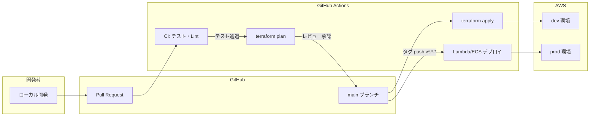
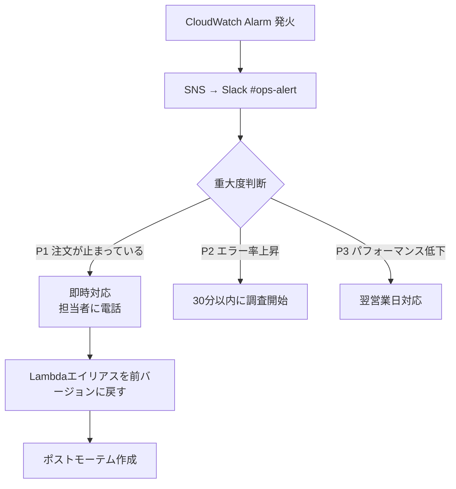

# デプロイ・運用設計

---

## デプロイフロー



### 本番デプロイの条件

1. `main` ブランチへのマージ → dev 環境に自動デプロイ
2. `v1.2.3` 形式のタグ push → prod 環境にデプロイ（手動承認付き）
3. `terraform apply` は必ず `plan` のレビュー後

---

## Lambda デプロイ戦略

Lambda の更新は**エイリアス + ウェイトルーティング**でカナリアリリースを行う。

```
本番トラフィック:
  alias: production
    v1 (stable): 90%
    v2 (new):    10%  ← 新バージョンをまず 10% に流す

問題なければ:
  v2 を 100% に切り替え → v1 を削除
```

> **ロールバック:** エイリアスのウェイトを変えるだけなので 30 秒以内に完了。

---

## Terraform 管理方針

| 項目 | 設定 |
|---|---|
| state バックエンド | S3 + DynamoDB ロック |
| state ファイルの分割 | 環境（dev/prod）× レイヤー（network/app/data）で分割 |
| モジュール | `modules/` に共通コンポーネントを切り出す |
| バージョン固定 | `required_version = "~> 1.8"` を必ず書く |

```
state ファイルの構成:
  s3://order-tfstate/
    dev/
      network/terraform.tfstate
      app/terraform.tfstate
      data/terraform.tfstate
    prod/
      network/terraform.tfstate
      app/terraform.tfstate
      data/terraform.tfstate
```

> **network と app を分ける理由:** VPC の変更は稀で影響が大きい。  
> Lambda の更新は頻繁。分けることで apply のスコープを最小化する。

---

## インシデント対応フロー



### よく使う調査コマンド

```bash
# Lambda のエラーログを直近 1 時間で検索
aws logs filter-log-events \
  --log-group-name /aws/lambda/order-create \
  --start-time $(date -d '1 hour ago' +%s000) \
  --filter-pattern "ERROR"

# SQS DLQ のメッセージ数確認
aws sqs get-queue-attributes \
  --queue-url https://sqs.ap-northeast-1.amazonaws.com/<ACCOUNT>/order-queue-dlq \
  --attribute-names ApproximateNumberOfMessages

# Lambda の現在のエイリアス確認
aws lambda get-alias \
  --function-name order-create \
  --name production
```

---

## 設計上の禁止事項（AI 参照用）

- 本番への直接デプロイ禁止（必ず dev → prod の順）
- `terraform apply -auto-approve` を本番で実行禁止
- Lambda のバージョン管理なしでのデプロイ禁止（ロールバックできなくなる）
- `aws configure` でアクセスキーを設定しない（IAM ロール / SSO を使う）
